# Functional Design Document

## DiscountScraper System

**Version:** 1.0  
**Date:** October 24, 2025  
**Project:** SaleScraper  
**Author:** System Analysis

---

## 1. Purpose

### 1.1 System Purpose

The DiscountScraper system is designed to automatically collect, store, and present discount information from multiple Dutch supermarket chains (Albert Heijn, Dirk, and PLUS) in a centralized, searchable database with a modern web interface.

### 1.2 Business Goals

- **Price Transparency**: Enable consumers to compare discounts across multiple supermarkets
- **Time Savings**: Eliminate manual browsing of multiple supermarket websites
- **Data-Driven Decisions**: Provide historical discount data for trend analysis
- **Automation**: Reduce manual effort through scheduled scraping operations
- **Reliability**: Track scraper performance and maintain data quality

### 1.3 Target Audience

- **End Consumers**: Individuals looking for the best grocery deals
- **Budget-Conscious Shoppers**: Users wanting to optimize shopping expenses
- **Data Analysts**: Users interested in discount patterns and price trends
- **System Administrators**: Technical users managing scraper operations

### 1.4 Key Benefits

- Centralized view of discounts from multiple supermarkets
- Real-time discount information with expiration tracking
- Fast full-text search across products (10-15x faster than JSON storage)
- Automated scheduling with promotion-based timing
- Complete audit trail of all scraping operations
- RESTful API for potential third-party integrations

---

## 2. Scope

### 2.1 In Scope

#### Core Features

- ✅ **Web Scraping Engine**

  - Automated discount data collection from Albert Heijn, Dirk, and PLUS
  - Playwright-based browser automation
  - Cookie consent handling
  - Product categorization
  - Promotion expiration date extraction

- ✅ **Data Management**

  - PostgreSQL database with optimized indexing
  - Product deduplication (by name + supermarket)
  - Discount lifecycle management (active/inactive states)
  - Historical data retention
  - UPSERT logic for data updates

- ✅ **Scheduling System**

  - Cron-based scheduler (checks every minute)
  - Promotion-driven scheduling (auto-schedules next run based on expiry)
  - Manual trigger capability
  - Enable/disable per supermarket

- ✅ **REST API**

  - Discount retrieval endpoints
  - Scraper execution triggers
  - Run history and statistics
  - Dashboard metrics
  - Scheduler management

- ✅ **Web Interface**

  - Notion-inspired UI design
  - Database view with sortable columns
  - Global and per-column search
  - Discount filtering (date, category, price)
  - Configurations dashboard
  - Scraper run logs with pagination

- ✅ **Monitoring & Logging**

  - Comprehensive run tracking
  - Success/failure metrics
  - Duration monitoring
  - Product and discount counters
  - Error message capture

- ✅ **Containerization**
  - Docker Compose orchestration
  - Three-tier architecture (database, API, web)
  - Environment-based configuration

### 2.2 Out of Scope (Current Version)

#### Not Implemented

- ❌ User authentication and authorization
- ❌ User accounts and personalization
- ❌ Price alerts and notifications
- ❌ Shopping list functionality
- ❌ Mobile native applications
- ❌ Email/SMS notifications
- ❌ Multi-language support (currently Dutch-focused)
- ❌ Product image storage
- ❌ Barcode/EAN matching across supermarkets
- ❌ Price history charts/visualization
- ❌ External API rate limiting
- ❌ Data export functionality (CSV/Excel)
- ❌ Advanced analytics dashboard
- ❌ Automatic product categorization across supermarkets

### 2.3 System Boundaries


### 2.4 Technology Stack

| Layer                | Technology              | Version |
| -------------------- | ----------------------- | ------- |
| **Frontend**         | React + TypeScript      | Latest  |
| **Frontend Build**   | Vite                    | Latest  |
| **Web Server**       | Nginx                   | Latest  |
| **Backend**          | Node.js + Express       | Latest  |
| **Language**         | TypeScript              | Latest  |
| **Web Scraping**     | Playwright              | Latest  |
| **Database**         | PostgreSQL              | 15+     |
| **Scheduling**       | node-cron               | Latest  |
| **Containerization** | Docker + Docker Compose | Latest  |
| **HTTP Client**      | Axios                   | Latest  |

---

## 3. User Stories & Use Cases

### 3.1 User Personas

#### Persona 1: Budget-Conscious Consumer (Maria)

- **Age**: 32
- **Occupation**: Teacher
- **Tech Savvy**: Medium
- **Goals**: Save money on groceries, plan weekly shopping
- **Pain Points**: Manually checking multiple websites is time-consuming

#### Persona 2: Deal Hunter (Tom)

- **Age**: 45
- **Occupation**: IT Professional
- **Tech Savvy**: High
- **Goals**: Find the absolute best deals, track discount patterns
- **Pain Points**: Wants API access, historical data

#### Persona 3: System Administrator (Admin)

- **Age**: 28
- **Occupation**: DevOps Engineer
- **Tech Savvy**: Expert
- **Goals**: Ensure scrapers run reliably, monitor system health
- **Pain Points**: Needs visibility into scraper failures, run metrics

### 3.2 User Stories

#### Epic 1: Discount Discovery

```
US-001: View Active Discounts
As a consumer
I want to see all active discounts from all supermarkets
So that I can find the best deals without visiting multiple websites

Acceptance Criteria:
- Display products with discount prices
- Show original price vs. discount price
- Display expiration date
- Filter by supermarket
- Search by product name
```

```
US-002: Search for Specific Products
As a consumer
I want to search for specific products by name
So that I can quickly find deals on items I need

Acceptance Criteria:
- Full-text search functionality
- Search across all supermarkets
- Display results within 1 second
- Highlight search terms in results
```

```
US-003: Filter Discounts by Criteria
As a consumer
I want to filter discounts by price range, category, and expiration date
So that I can narrow down deals relevant to me

Acceptance Criteria:
- Filter by price range (min/max)
- Filter by product category
- Filter by expiration date
- Combine multiple filters
- Clear all filters option
```

#### Epic 2: Scraper Management

```
US-004: Trigger Manual Scraper Run
As an administrator
I want to manually trigger a scraper for a specific supermarket
So that I can get fresh data on demand

Acceptance Criteria:
- Button to trigger each supermarket scraper
- Confirmation dialog before running
- Visual feedback during execution
- Success/failure notification
- Updated data immediately visible
```

```
US-005: Monitor Scraper Performance
As an administrator
I want to view scraper run history and metrics
So that I can ensure the system is functioning properly

Acceptance Criteria:
- View all scraper runs with timestamps
- See success/failure status
- View products scraped/created/updated counts
- View run duration
- Filter by supermarket
- Paginated results
```

```
US-006: View System Statistics
As an administrator
I want to see overall system statistics
So that I can understand system health at a glance

Acceptance Criteria:
- Total number of runs
- Overall success rate
- Total active products
- Unique products count
- Next scheduled run time
```

#### Epic 3: Scheduled Operations

```
US-007: Automatic Scheduled Scraping
As an administrator
I want scrapers to run automatically based on promotion schedules
So that data stays fresh without manual intervention

Acceptance Criteria:
- Scrapers schedule next run based on promotion expiry
- Scheduler checks every minute for due runs
- Failed runs don't block future schedules
- Logging of all automated runs
```

```
US-008: Enable/Disable Scheduled Runs
As an administrator
I want to enable or disable scheduled runs per supermarket
So that I can control when automated scraping occurs

Acceptance Criteria:
- Toggle scheduled runs on/off per supermarket
- Status persists across system restarts
- Visual indication of enabled/disabled state
- Manual runs still work when disabled
```

### 3.3 Use Cases

#### Use Case 1: View Current Discounts


**Preconditions:**

- System is running and accessible
- At least one scraper has completed successfully
- Active discounts exist in database

**Main Flow:**

1. Consumer navigates to web interface (http://localhost:3000)
2. System loads and displays all active discounts
3. Discounts are sorted by expiration date, category, and name
4. Consumer can search by product name
5. Consumer can filter by category, price, or expiration date
6. Results update in real-time

**Postconditions:**

- Consumer views relevant discount information
- No data is modified

**Alternative Flows:**

- **3a**: No discounts available → Display "No discounts found" message
- **4a**: Search returns no results → Display "No matching products"

#### Use Case 2: Run Scraper Manually


**Preconditions:**

- Administrator has access to Configurations page
- Database is accessible
- Target supermarket website is reachable
- Scraper is not already running for this supermarket

**Main Flow:**

1. Administrator navigates to Configurations page
2. Administrator clicks "Run Scraper" for desired supermarket
3. System displays confirmation dialog
4. Administrator confirms action
5. System creates scraper_run record with "running" status
6. Scraper initializes Playwright browser
7. Scraper navigates to supermarket website
8. Scraper handles cookie consent popup
9. Scraper extracts promotion expiration date
10. For each product category:
    - Scraper finds discount products
    - Scraper extracts product details (name, prices, category)
11. System upserts products to database
12. System marks old discounts as inactive
13. System creates new discount records
14. System updates scraper_run to "success"
15. System schedules next run based on promotion expiry
16. Web interface refreshes to show new data

**Postconditions:**

- New/updated products exist in database
- Old discounts marked as inactive (active=false)
- New discounts created with active=true
- Scraper run logged with metrics
- Next run scheduled
- Administrator sees success confirmation

**Alternative Flows:**

- **6a**: Browser initialization fails → Log error, update run status to "failed"
- **7a**: Website unreachable → Timeout, mark run as "failed"
- **8a**: Cookie popup not found → Log warning, continue
- **10a**: No products found → Log warning, complete with 0 products
- **11a**: Database error → Rollback transaction, mark run as "failed"

#### Use Case 3: Automated Scheduled Scraping

```mermaid
sequenceDiagram
    participant Cron as Cron Job (every minute)
    participant Scheduler as Scheduler Service
    participant DB as Database
    participant API as Internal API
    participant Scraper as Scraper Service

    loop Every minute
        Cron->>Scheduler: Trigger check
        Scheduler->>DB: Deactivate expired discounts
        DB-->>Scheduler: Count of deactivated

        Scheduler->>DB: SELECT due scheduled_runs
        DB-->>Scheduler: Return due runs (if any)

        alt Has due runs
            loop For each due run
                Scheduler->>API: POST /api/scraper/run/:supermarket
                API->>Scraper: Execute scraper (async)
                Scraper-->>API: Acknowledge start
                API-->>Scheduler: 200 OK

                Note over Scraper,DB: Scraper runs in background
                Scraper->>DB: Update data
                Scraper->>DB: Schedule next run
            end
        else No due runs
            Scheduler->>Scheduler: Log "No due runs"
        end
    end
```



**Preconditions:**

- Scheduler service is running
- At least one scheduled_run exists with enabled=true
- scheduled_run.next_run_at <= current time

**Main Flow:**

1. Cron job triggers every minute
2. Scheduler checks for expired discounts
3. System deactivates discounts where expire_date < NOW()
4. Scheduler queries scheduled_runs table for due runs
5. For each due run:
   - Scheduler triggers scraper via internal API
   - Scraper executes asynchronously
   - Scraper completes and updates next_run_at
6. Scheduler logs completion and waits for next cycle

**Postconditions:**

- Expired discounts marked as inactive
- Due scrapers executed
- Next run times updated
- All operations logged

**Alternative Flows:**

- **4a**: No due runs → Log "No due runs", wait for next cycle
- **5a**: API call fails → Log error, continue with other scrapers
- **5b**: Scraper already running → Skip this run

#### Use Case 4: Search and Filter Discounts


**Preconditions:**

- Discounts data loaded in web interface
- Consumer on Discounts View page

**Main Flow:**

1. Consumer enters text in global search bar
2. System filters all columns for matching text
3. Table updates to show only matching rows
4. Consumer applies additional column filter (e.g., category)
5. System further filters results
6. Consumer clicks column header to sort
7. System sorts visible results
8. Consumer can clear all filters to reset view

**Postconditions:**

- Table shows filtered/sorted results
- Original data unchanged
- Filter state persists during session

---

## 4. Functional Requirements

### 4.1 Core System Requirements

#### FR-001: Web Scraping Engine

| ID        | Requirement                                                                  | Priority | Status         |
| --------- | ---------------------------------------------------------------------------- | -------- | -------------- |
| FR-001.1  | System SHALL scrape discount data from Albert Heijn website                  | HIGH     | ✅ Implemented |
| FR-001.2  | System SHALL scrape discount data from Dirk website                          | HIGH     | ✅ Implemented |
| FR-001.3  | System SHALL scrape discount data from PLUS website                          | HIGH     | ✅ Implemented |
| FR-001.4  | System SHALL handle cookie consent popups automatically                      | HIGH     | ✅ Implemented |
| FR-001.5  | System SHALL extract promotion expiration dates                              | HIGH     | ✅ Implemented |
| FR-001.6  | System SHALL extract product names, categories, prices, and discount details | HIGH     | ✅ Implemented |
| FR-001.7  | System SHALL use Playwright for browser automation                           | HIGH     | ✅ Implemented |
| FR-001.8  | System SHALL support configurable web identifiers per supermarket            | MEDIUM   | ✅ Implemented |
| FR-001.9  | System SHALL log all scraping activities with timestamps                     | MEDIUM   | ✅ Implemented |
| FR-001.10 | System SHALL handle network timeouts gracefully                              | MEDIUM   | ✅ Implemented |

#### FR-002: Data Storage & Management

| ID        | Requirement                                                            | Priority | Status         |
| --------- | ---------------------------------------------------------------------- | -------- | -------------- |
| FR-002.1  | System SHALL store all data in PostgreSQL database                     | HIGH     | ✅ Implemented |
| FR-002.2  | System SHALL enforce unique constraint on product (name + supermarket) | HIGH     | ✅ Implemented |
| FR-002.3  | System SHALL update existing products instead of creating duplicates   | HIGH     | ✅ Implemented |
| FR-002.4  | System SHALL maintain active/inactive status for discounts             | HIGH     | ✅ Implemented |
| FR-002.5  | System SHALL preserve historical discount data                         | MEDIUM   | ✅ Implemented |
| FR-002.6  | System SHALL use optimized indexes for fast queries                    | HIGH     | ✅ Implemented |
| FR-002.7  | System SHALL support full-text search on product names                 | MEDIUM   | ✅ Implemented |
| FR-002.8  | System SHALL automatically update timestamps on record changes         | LOW      | ✅ Implemented |
| FR-002.9  | System SHALL cascade delete discounts when products are deleted        | MEDIUM   | ✅ Implemented |
| FR-002.10 | System SHALL store supermarket configurations in database              | MEDIUM   | ✅ Implemented |

#### FR-003: Scheduling System

| ID       | Requirement                                                            | Priority | Status         |
| -------- | ---------------------------------------------------------------------- | -------- | -------------- |
| FR-003.1 | System SHALL check for due scraper runs every minute                   | HIGH     | ✅ Implemented |
| FR-003.2 | System SHALL automatically schedule next run based on promotion expiry | HIGH     | ✅ Implemented |
| FR-003.3 | System SHALL support enable/disable toggle per supermarket             | MEDIUM   | ✅ Implemented |
| FR-003.4 | System SHALL NOT run multiple instances of same scraper concurrently   | HIGH     | ✅ Implemented |
| FR-003.5 | System SHALL deactivate expired discounts on each scheduler check      | HIGH     | ✅ Implemented |
| FR-003.6 | System SHALL log all scheduler activities                              | MEDIUM   | ✅ Implemented |
| FR-003.7 | System SHALL persist scheduled run state across restarts               | MEDIUM   | ✅ Implemented |
| FR-003.8 | System SHALL trigger scrapers via internal API calls                   | MEDIUM   | ✅ Implemented |

#### FR-004: REST API

| ID        | Requirement                                                              | Priority | Status         |
| --------- | ------------------------------------------------------------------------ | -------- | -------------- |
| FR-004.1  | System SHALL provide health check endpoint                               | HIGH     | ✅ Implemented |
| FR-004.2  | System SHALL provide endpoint to retrieve all active discounts           | HIGH     | ✅ Implemented |
| FR-004.3  | System SHALL provide endpoint to trigger scraper runs                    | HIGH     | ✅ Implemented |
| FR-004.4  | System SHALL provide endpoint to retrieve scraper run history            | MEDIUM   | ✅ Implemented |
| FR-004.5  | System SHALL provide endpoint to retrieve dashboard statistics           | MEDIUM   | ✅ Implemented |
| FR-004.6  | System SHALL provide endpoint to retrieve supermarket statuses           | MEDIUM   | ✅ Implemented |
| FR-004.7  | System SHALL provide endpoint to manage scheduled runs                   | MEDIUM   | ✅ Implemented |
| FR-004.8  | System SHALL provide endpoint to manually cleanup expired discounts      | LOW      | ✅ Implemented |
| FR-004.9  | System SHALL return JSON formatted responses                             | HIGH     | ✅ Implemented |
| FR-004.10 | System SHALL handle errors gracefully with appropriate HTTP status codes | HIGH     | ✅ Implemented |

#### FR-005: Web Interface

| ID        | Requirement                                                        | Priority | Status         |
| --------- | ------------------------------------------------------------------ | -------- | -------------- |
| FR-005.1  | System SHALL provide web interface accessible via browser          | HIGH     | ✅ Implemented |
| FR-005.2  | System SHALL display all active discounts in table format          | HIGH     | ✅ Implemented |
| FR-005.3  | System SHALL support global search across all columns              | HIGH     | ✅ Implemented |
| FR-005.4  | System SHALL support per-column text filtering                     | MEDIUM   | ✅ Implemented |
| FR-005.5  | System SHALL support sorting by any column                         | MEDIUM   | ✅ Implemented |
| FR-005.6  | System SHALL provide quick filters (date, category, name)          | MEDIUM   | ✅ Implemented |
| FR-005.7  | System SHALL display default sorting by expiration, category, name | MEDIUM   | ✅ Implemented |
| FR-005.8  | System SHALL provide Configurations dashboard                      | MEDIUM   | ✅ Implemented |
| FR-005.9  | System SHALL display KPIs (runs, success rate, products)           | MEDIUM   | ✅ Implemented |
| FR-005.10 | System SHALL provide manual scraper trigger buttons                | MEDIUM   | ✅ Implemented |
| FR-005.11 | System SHALL display scraper run logs with pagination              | MEDIUM   | ✅ Implemented |
| FR-005.12 | System SHALL use Notion-inspired design aesthetics                 | LOW      | ✅ Implemented |
| FR-005.13 | System SHALL be responsive for mobile devices                      | LOW      | ✅ Implemented |
| FR-005.14 | System SHALL provide confirmation dialog before running scrapers   | MEDIUM   | ✅ Implemented |

#### FR-006: Monitoring & Logging

| ID       | Requirement                                                           | Priority | Status         |
| -------- | --------------------------------------------------------------------- | -------- | -------------- |
| FR-006.1 | System SHALL log all scraper activities to dedicated log files        | HIGH     | ✅ Implemented |
| FR-006.2 | System SHALL track scraper run status (running/success/failed)        | HIGH     | ✅ Implemented |
| FR-006.3 | System SHALL record products scraped/created/updated counts           | HIGH     | ✅ Implemented |
| FR-006.4 | System SHALL record discounts created/deactivated counts              | HIGH     | ✅ Implemented |
| FR-006.5 | System SHALL measure and store run duration                           | MEDIUM   | ✅ Implemented |
| FR-006.6 | System SHALL capture error messages for failed runs                   | HIGH     | ✅ Implemented |
| FR-006.7 | System SHALL log server activities separately from scraper activities | MEDIUM   | ✅ Implemented |
| FR-006.8 | System SHALL support configurable log levels                          | LOW      | ✅ Implemented |

### 4.2 Non-Functional Requirements

#### NFR-001: Performance

| ID        | Requirement                                                        | Priority | Status         |
| --------- | ------------------------------------------------------------------ | -------- | -------------- |
| NFR-001.1 | System SHALL return search results within 1 second                 | HIGH     | ✅ Implemented |
| NFR-001.2 | System SHALL complete scraper run within 5 minutes per supermarket | MEDIUM   | ✅ Implemented |
| NFR-001.3 | Database queries SHALL be 10-15x faster than JSON storage          | HIGH     | ✅ Implemented |
| NFR-001.4 | System SHALL support concurrent read operations                    | MEDIUM   | ✅ Implemented |
| NFR-001.5 | Web interface SHALL load within 2 seconds                          | MEDIUM   | ✅ Implemented |

#### NFR-002: Reliability

| ID        | Requirement                                                         | Priority | Status         |
| --------- | ------------------------------------------------------------------- | -------- | -------------- |
| NFR-002.1 | System SHALL recover gracefully from scraper failures               | HIGH     | ✅ Implemented |
| NFR-002.2 | System SHALL continue operation if one supermarket is unreachable   | HIGH     | ✅ Implemented |
| NFR-002.3 | Database transactions SHALL be ACID-compliant                       | HIGH     | ✅ Implemented |
| NFR-002.4 | System SHALL maintain data consistency during concurrent operations | HIGH     | ✅ Implemented |

#### NFR-003: Scalability

| ID        | Requirement                                                         | Priority | Status         |
| --------- | ------------------------------------------------------------------- | -------- | -------------- |
| NFR-003.1 | System SHALL support addition of new supermarkets via configuration | MEDIUM   | ✅ Implemented |
| NFR-003.2 | Database schema SHALL support thousands of products                 | HIGH     | ✅ Implemented |
| NFR-003.3 | System SHALL handle multiple concurrent web users                   | MEDIUM   | ✅ Implemented |

#### NFR-004: Maintainability

| ID        | Requirement                                                   | Priority | Status         |
| --------- | ------------------------------------------------------------- | -------- | -------------- |
| NFR-004.1 | System SHALL use TypeScript for type safety                   | MEDIUM   | ✅ Implemented |
| NFR-004.2 | Code SHALL follow modular architecture patterns               | MEDIUM   | ✅ Implemented |
| NFR-004.3 | Configuration SHALL be externalized via environment variables | HIGH     | ✅ Implemented |
| NFR-004.4 | Database schema SHALL include documentation comments          | LOW      | ✅ Implemented |

#### NFR-005: Usability

| ID        | Requirement                                              | Priority | Status         |
| --------- | -------------------------------------------------------- | -------- | -------------- |
| NFR-005.1 | Web interface SHALL be intuitive without training        | HIGH     | ✅ Implemented |
| NFR-005.2 | System SHALL provide visual feedback for long operations | MEDIUM   | ✅ Implemented |
| NFR-005.3 | Error messages SHALL be clear and actionable             | MEDIUM   | ✅ Implemented |

#### NFR-006: Deployment

| ID        | Requirement                                          | Priority | Status         |
| --------- | ---------------------------------------------------- | -------- | -------------- |
| NFR-006.1 | System SHALL be deployable via Docker Compose        | HIGH     | ✅ Implemented |
| NFR-006.2 | System SHALL start all services with single command  | HIGH     | ✅ Implemented |
| NFR-006.3 | Database SHALL initialize automatically on first run | HIGH     | ✅ Implemented |
| NFR-006.4 | System SHALL support environment-based configuration | HIGH     | ✅ Implemented |

### 4.3 System Behavior

#### Discount Lifecycle


#### Scraper Run States


---

## 5. Data Structure

### 5.1 Entity Relationship Diagram


### 5.2 Table Specifications

#### Table: supermarket_configs

**Purpose:** Store configuration for each supermarket including scraping identifiers

| Column          | Type         | Constraints      | Description                                  |
| --------------- | ------------ | ---------------- | -------------------------------------------- |
| id              | SERIAL       | PRIMARY KEY      | Auto-incrementing ID                         |
| name            | VARCHAR(255) | NOT NULL, UNIQUE | Full supermarket name (e.g., "Albert Heijn") |
| name_short      | VARCHAR(50)  | NULL             | Short name (e.g., "AH")                      |
| url             | VARCHAR(512) | NOT NULL         | Base URL for scraping                        |
| web_identifiers | JSONB        | NOT NULL         | CSS selectors and scraping configuration     |
| created_at      | TIMESTAMP    | DEFAULT NOW()    | Record creation timestamp                    |
| updated_at      | TIMESTAMP    | DEFAULT NOW()    | Last update timestamp                        |

**Indexes:**

- `idx_supermarket_name` on `name`

**Sample Data:**

```json
{
  "name": "Albert Heijn",
  "name_short": "AH",
  "url": "https://www.ah.nl/bonus",
  "web_identifiers": {
    "cookieDecline": "button#decline-cookies",
    "promotionExpireDate": "div.promotion-period",
    "productCategories": ["category1", "category2"],
    "products": "div.product-card",
    "promotionProducts": {
      "name": "h3.product-name",
      "price": "span.price",
      "discount": "span.discount"
    }
  }
}
```

#### Table: products

**Purpose:** Store unique products identified by name + supermarket combination

| Column      | Type         | Constraints   | Description                   |
| ----------- | ------------ | ------------- | ----------------------------- |
| id          | SERIAL       | PRIMARY KEY   | Auto-incrementing ID          |
| name        | VARCHAR(500) | NOT NULL      | Product name                  |
| category    | VARCHAR(255) | NOT NULL      | Product category              |
| supermarket | VARCHAR(255) | NOT NULL      | Supermarket name              |
| created_at  | TIMESTAMP    | DEFAULT NOW() | First time product was seen   |
| updated_at  | TIMESTAMP    | DEFAULT NOW() | Last time product was updated |

**Constraints:**

- UNIQUE(name, supermarket) - Ensures no duplicate products per supermarket

**Indexes:**

- `idx_product_name` on `name`
- `idx_product_category` on `category`
- `idx_product_supermarket` on `supermarket`
- `idx_product_name_supermarket` on `(name, supermarket)`
- `idx_product_category_supermarket` on `(category, supermarket)`
- `idx_product_name_fulltext` on `to_tsvector('english', name)` (GIN index)

**Business Rules:**

- Products are updated (not recreated) when same name+supermarket is scraped again
- Products can have multiple discounts over time
- Products are never automatically deleted

#### Table: discounts

**Purpose:** Store discount information linked to products with active/inactive lifecycle

| Column           | Type          | Constraints                 | Description                             |
| ---------------- | ------------- | --------------------------- | --------------------------------------- |
| id               | SERIAL        | PRIMARY KEY                 | Auto-incrementing ID                    |
| product_id       | INTEGER       | NOT NULL, FK → products(id) | Reference to product                    |
| original_price   | DECIMAL(10,2) | NOT NULL, DEFAULT 0         | Pre-discount price                      |
| discount_price   | DECIMAL(10,2) | NOT NULL                    | Discounted price                        |
| special_discount | VARCHAR(255)  | NULL                        | Special conditions (e.g., "2+1 gratis") |
| expire_date      | TIMESTAMP     | NOT NULL                    | When discount expires                   |
| active           | BOOLEAN       | NOT NULL, DEFAULT true      | Is discount currently active            |
| created_at       | TIMESTAMP     | DEFAULT NOW()               | When discount was first scraped         |

**Cascade:**

- ON DELETE CASCADE - Discounts deleted when product is deleted

**Indexes:**

- `idx_discount_product_id` on `product_id`
- `idx_discount_expire_date` on `expire_date`
- `idx_discount_price_range` on `discount_price`
- `idx_discount_active` on `active`
- `idx_discount_product_expire` on `(product_id, expire_date)`
- `idx_discount_product_active` on `(product_id, active)`

**Business Rules:**

- When scraper runs, existing active discounts for products not found are marked `active=false`
- When scheduler runs, discounts with `expire_date < NOW()` are marked `active=false`
- Only active discounts (`active=true`) are returned by API and shown in web interface
- Inactive discounts are preserved for historical analysis

#### Table: scraper_runs

**Purpose:** Complete audit trail of all scraper executions with detailed metrics

| Column                | Type         | Constraints     | Description                       |
| --------------------- | ------------ | --------------- | --------------------------------- |
| id                    | SERIAL       | PRIMARY KEY     | Auto-incrementing ID              |
| supermarket           | VARCHAR(255) | NOT NULL        | Supermarket name                  |
| status                | VARCHAR(50)  | NOT NULL, CHECK | 'running', 'success', or 'failed' |
| products_scraped      | INTEGER      | DEFAULT 0       | Total products found by scraper   |
| products_updated      | INTEGER      | DEFAULT 0       | Existing products updated         |
| products_created      | INTEGER      | DEFAULT 0       | New products created              |
| discounts_deactivated | INTEGER      | DEFAULT 0       | Old discounts marked inactive     |
| discounts_created     | INTEGER      | DEFAULT 0       | New discounts created             |
| error_message         | TEXT         | NULL            | Error details if failed           |
| started_at            | TIMESTAMP    | DEFAULT NOW()   | When run started                  |
| completed_at          | TIMESTAMP    | NULL            | When run completed                |
| duration_seconds      | INTEGER      | NULL            | Total run time                    |
| promotion_expire_date | TIMESTAMP    | NULL            | Expiry date of scraped promotion  |
| created_at            | TIMESTAMP    | DEFAULT NOW()   | Record creation timestamp         |
| updated_at            | TIMESTAMP    | DEFAULT NOW()   | Last update timestamp             |

**Indexes:**

- `idx_scraper_runs_supermarket` on `supermarket`
- `idx_scraper_runs_status` on `status`
- `idx_scraper_runs_started_at` on `started_at DESC`
- `idx_scraper_runs_supermarket_status` on `(supermarket, status)`

**Business Rules:**

- Run created with status='running' before scraper starts
- Updated to status='success' on successful completion
- Updated to status='failed' with error_message on failure
- duration_seconds calculated as difference between completed_at and started_at

#### Table: scheduled_runs

**Purpose:** Manage automatic scheduling of scraper runs based on promotion cycles

| Column                | Type         | Constraints            | Description                                     |
| --------------------- | ------------ | ---------------------- | ----------------------------------------------- |
| id                    | SERIAL       | PRIMARY KEY            | Auto-incrementing ID                            |
| supermarket           | VARCHAR(255) | NOT NULL, UNIQUE       | Supermarket name (one schedule per supermarket) |
| next_run_at           | TIMESTAMP    | NOT NULL               | When scraper should run next                    |
| promotion_expire_date | TIMESTAMP    | NOT NULL               | Current promotion expiry date                   |
| enabled               | BOOLEAN      | NOT NULL, DEFAULT true | Is scheduled run enabled                        |
| created_at            | TIMESTAMP    | DEFAULT NOW()          | Record creation timestamp                       |
| updated_at            | TIMESTAMP    | DEFAULT NOW()          | Last update timestamp                           |

**Indexes:**

- `idx_scheduled_runs_supermarket` on `supermarket`
- `idx_scheduled_runs_next_run_at` on `next_run_at`
- `idx_scheduled_runs_enabled` on `enabled`

**Business Rules:**

- Scheduler checks every minute for rows where `next_run_at <= NOW() AND enabled=true`
- After successful scraper run, `next_run_at` is calculated based on new `promotion_expire_date`
- Typically scheduled to run on or just after promotion expiry
- Can be disabled per supermarket via `enabled=false`

### 5.3 Database Indexes Strategy

#### Performance Optimization

**Full-Text Search:**

```sql
CREATE INDEX idx_product_name_fulltext
ON products USING gin(to_tsvector('english', name));
```

- Enables fast text search across product names
- 10-15x faster than LIKE queries
- Supports weighted relevance ranking

**Composite Indexes:**

```sql
CREATE INDEX idx_product_name_supermarket ON products(name, supermarket);
CREATE INDEX idx_discount_product_active ON discounts(product_id, active);
```

- Optimizes common query patterns
- Reduces need for multiple index scans
- Improves JOIN performance

**Partial Indexes (Considered but not implemented):**

```sql
-- Not used because NOW() is not immutable in PostgreSQL
-- CREATE INDEX idx_discount_active_future ON discounts(product_id)
-- WHERE active = true AND expire_date > NOW();
```

### 5.4 Data Flow Diagram


### 5.5 API Data Contracts

#### GET /api/discounts

**Response:** Array of discount objects with embedded product information

```typescript
interface DiscountResponse {
  id: number; // Product ID
  name: string; // Product name
  category: string; // Product category
  supermarket: string; // Supermarket name
  created_at: string; // ISO 8601 timestamp
  updated_at: string; // ISO 8601 timestamp
  discount: {
    id: number; // Discount ID
    product_id: number; // Foreign key to product
    original_price: number; // Pre-discount price
    discount_price: number; // Discounted price
    special_discount: string | null; // e.g., "2+1 gratis"
    expire_date: string; // ISO 8601 timestamp
    active: boolean; // Always true for this endpoint
    created_at: string; // ISO 8601 timestamp
  };
}
```

**Example:**

```json
[
  {
    "id": 123,
    "name": "Coca Cola 1.5L",
    "category": "Dranken",
    "supermarket": "Albert Heijn",
    "created_at": "2025-10-20T10:00:00.000Z",
    "updated_at": "2025-10-24T08:30:00.000Z",
    "discount": {
      "id": 456,
      "product_id": 123,
      "original_price": 2.49,
      "discount_price": 1.99,
      "special_discount": null,
      "expire_date": "2025-10-31T23:59:59.000Z",
      "active": true,
      "created_at": "2025-10-24T08:30:00.000Z"
    }
  }
]
```

#### POST /api/scraper/run/:supermarket

**Parameters:**

- `:supermarket` - One of: `albert-heijn`, `dirk`, `plus`

**Response:**

```typescript
interface ScraperRunResponse {
  success: boolean;
  message: string;
  data: {
    runId: number;
    supermarket: string;
    productsScraped: number;
    productsCreated: number;
    productsUpdated: number;
    discountsCreated: number;
    discountsSkipped: number;
    timestamp: string; // ISO 8601
  };
}
```

**Example:**

```json
{
  "success": true,
  "message": "Scraper completed for Albert Heijn",
  "data": {
    "runId": 42,
    "supermarket": "Albert Heijn",
    "productsScraped": 150,
    "productsCreated": 12,
    "productsUpdated": 138,
    "discountsCreated": 150,
    "discountsSkipped": 0,
    "timestamp": "2025-10-24T14:30:00.000Z"
  }
}
```

#### GET /api/dashboard/stats

**Response:**

```typescript
interface DashboardStats {
  totalRuns: number; // Total scraper runs ever
  successRate: number; // Percentage (0-100)
  scrapedProducts: number; // Active discounts count
  uniqueProducts: number; // Total unique products
  nextScheduledRun: string; // Human-readable or "Not scheduled"
}
```

**Example:**

```json
{
  "totalRuns": 156,
  "successRate": 98.7,
  "scrapedProducts": 450,
  "uniqueProducts": 523,
  "nextScheduledRun": "Albert Heijn at 10/31/2025, 11:00:00 PM"
}
```

#### GET /api/dashboard/statuses

**Response:**

```typescript
interface SupermarketStatus {
  key: string; // URL-safe key
  name: string; // Display name
  status: "success" | "failed" | "running" | "pending";
  lastRun?: string; // ISO 8601 timestamp
  productsScraped?: number;
  runId?: number;
}
```

**Example:**

```json
[
  {
    "key": "albert-heijn",
    "name": "Albert Heijn",
    "status": "success",
    "lastRun": "2025-10-24T08:30:00.000Z",
    "productsScraped": 150,
    "runId": 42
  },
  {
    "key": "dirk",
    "name": "Dirk",
    "status": "pending"
  }
]
```

### 5.6 Configuration Data Structure

#### Web Identifiers (JSONB)

**Purpose:** Store CSS selectors and scraping configuration per supermarket

**Schema:**

```typescript
interface WebIdentifiers {
  cookieDecline: string; // CSS selector for cookie decline button
  promotionExpireDate: string; // CSS selector for promotion end date
  productCategories: string[]; // Array of category identifiers
  products: string; // CSS selector for product cards
  promotionProducts: {
    name: string; // CSS selector for product name
    originalPrice: string; // CSS selector for original price
    discountPrice: string; // CSS selector for discount price
    specialDiscount: string; // CSS selector for special offers
  };
}
```

**Benefits:**

- Easy to update selectors without code changes
- Supports per-supermarket customization
- Stored in database for runtime flexibility
- Can be modified via database migrations

### 5.7 System Architecture Diagram


---

## 6. System Integration

### 6.1 Component Interaction


### 6.2 Deployment Architecture


### 6.3 Technology Integration Points

| Integration             | Technology         | Purpose                    | Protocol                 |
| ----------------------- | ------------------ | -------------------------- | ------------------------ |
| Frontend ↔ Backend      | Axios              | API communication          | HTTP/REST                |
| Backend ↔ Database      | pg (node-postgres) | Data persistence           | PostgreSQL Wire Protocol |
| Scraper ↔ Websites      | Playwright         | Web scraping               | HTTP/HTTPS               |
| Scheduler ↔ Backend     | node-cron + Axios  | Automated triggers         | HTTP (internal)          |
| Web Server ↔ Frontend   | Nginx              | Static file serving        | HTTP                     |
| Container Orchestration | Docker Compose     | Multi-container deployment | Docker API               |

---

## 7. Future Enhancements

### 7.1 Potential Features

1. **User Accounts & Personalization**

   - User registration and authentication
   - Personalized discount recommendations
   - Shopping lists with discount tracking
   - Favorite products and price alerts

2. **Advanced Analytics**

   - Price history charts
   - Discount trend analysis
   - Best time to buy recommendations
   - Savings calculator

3. **Notification System**

   - Email alerts for specific products
   - Push notifications for price drops
   - Weekly digest of best deals

4. **Product Matching**

   - Cross-supermarket product matching
   - Barcode/EAN integration
   - Price comparison across supermarkets

5. **Data Export**

   - CSV/Excel export
   - PDF reports
   - API for third-party integrations

6. **Mobile Applications**

   - Native iOS app
   - Native Android app
   - Location-based supermarket filtering

7. **Enhanced Scraping**

   - Product images
   - Nutritional information
   - Stock availability
   - More supermarket chains

8. **Administrative Features**
   - Web-based configuration editor
   - A/B testing for scraper strategies
   - Performance dashboards
   - Automated testing of scrapers

### 7.2 Scalability Considerations

- **Horizontal Scaling**: Multiple scraper instances with job queue
- **Caching Layer**: Redis for frequently accessed data
- **CDN Integration**: CloudFlare for static assets
- **Database Replication**: Read replicas for query performance
- **Microservices**: Split into dedicated services (scraper, API, scheduler)

---

## 8. Glossary

| Term                   | Definition                                                                             |
| ---------------------- | -------------------------------------------------------------------------------------- |
| **Active Discount**    | A discount with `active=true` and `expire_date > NOW()`                                |
| **AJAX**               | Asynchronous JavaScript and XML - technique for updating web pages without full reload |
| **Cron Job**           | Time-based scheduled task                                                              |
| **CSS Selector**       | Pattern used to select HTML elements for scraping                                      |
| **Discount Lifecycle** | States: Scraped → Active → Inactive/Expired                                            |
| **Full-Text Search**   | Search technique using GIN indexes for natural language queries                        |
| **JSONB**              | PostgreSQL's binary JSON storage format                                                |
| **Playwright**         | Browser automation library for web scraping                                            |
| **Scheduled Run**      | Automated scraper execution based on promotion schedules                               |
| **Scraper Run**        | Single execution of scraper for one supermarket                                        |
| **UPSERT**             | Database operation that updates if exists, inserts if not                              |
| **Web Identifiers**    | Configuration containing CSS selectors for scraping                                    |

---

## 9. Appendix

### 9.1 API Endpoint Summary

| Method | Endpoint                             | Purpose                               |
| ------ | ------------------------------------ | ------------------------------------- |
| GET    | `/health`                            | Health check                          |
| GET    | `/api/discounts`                     | Retrieve all active discounts         |
| POST   | `/api/scraper/run/:supermarket`      | Trigger scraper run                   |
| GET    | `/api/scraper/runs`                  | Get all scraper runs                  |
| GET    | `/api/scraper/runs/:supermarket`     | Get runs for specific supermarket     |
| GET    | `/api/scraper/run/:id`               | Get specific run by ID                |
| GET    | `/api/dashboard/stats`               | Get dashboard statistics              |
| GET    | `/api/dashboard/statuses`            | Get supermarket statuses              |
| GET    | `/api/scheduler/runs`                | Get all scheduled runs                |
| GET    | `/api/scheduler/run/:supermarket`    | Get scheduled run for supermarket     |
| PUT    | `/api/scheduler/toggle/:supermarket` | Enable/disable scheduled run          |
| GET    | `/api/scheduler/due`                 | Get due scheduled runs                |
| POST   | `/api/discounts/cleanup`             | Manually deactivate expired discounts |

### 9.2 Database Query Examples

**Find all active discounts expiring soon:**

```sql
SELECT p.name, p.supermarket, d.discount_price, d.expire_date
FROM products p
INNER JOIN discounts d ON p.id = d.product_id
WHERE d.active = true
  AND d.expire_date BETWEEN NOW() AND NOW() + INTERVAL '3 days'
ORDER BY d.expire_date ASC;
```

**Get scraper success rate per supermarket:**

```sql
SELECT
  supermarket,
  COUNT(*) as total_runs,
  COUNT(*) FILTER (WHERE status = 'success') as successful_runs,
  ROUND(100.0 * COUNT(*) FILTER (WHERE status = 'success') / COUNT(*), 2) as success_rate
FROM scraper_runs
GROUP BY supermarket;
```

**Find products with most discount changes:**

```sql
SELECT
  p.name,
  p.supermarket,
  COUNT(d.id) as discount_count
FROM products p
INNER JOIN discounts d ON p.id = d.product_id
GROUP BY p.id, p.name, p.supermarket
ORDER BY discount_count DESC
LIMIT 10;
```

### 9.3 Configuration Example

**.env file:**

```properties
# Database Configuration
DB_HOST=postgres
DB_PORT=5432
DB_NAME=discount
DB_USER=discount_user
DB_PASSWORD=discount_pass

# API Configuration
API_PORT=3001

# Logging Configuration
LOG_LEVEL=INFO
```

**docker-compose.yml structure:**

```yaml
services:
  postgres:
    # PostgreSQL database

  scraper-api:
    # Node.js API + Scraper + Scheduler
    depends_on:
      - postgres

  web:
    # Nginx + React frontend
    depends_on:
      - scraper-api
```

---

**Document End**

_This functional design document represents the current implementation of the DiscountScraper system as of October 24, 2025. It should be updated as the system evolves._
